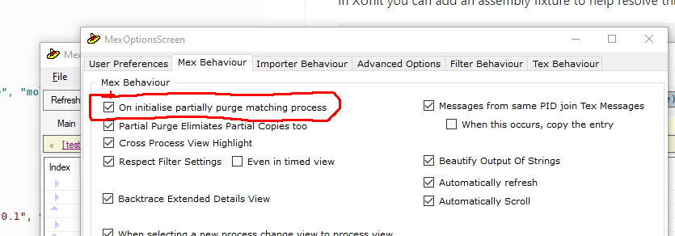

### Automatically Tracing In Xunit


When writing unit tests its often useful to be able to turn on tracing so that you can guage the level of trace that you are putting out in the code as it is being built. To turn the trace on, however, you need to add it to the constructor of the method you are testing so that when you run individual tests the trace comes through.  This can lead to lots of duplicate code.

In XUnit you can add an assembly fixture to help resolve this issue - add the following code to your solution:


```csharp
using Plisky.Diagnostics;
using Plisky.Diagnostics.Listeners;
using Xunit.Abstractions;
using Xunit.Sdk;

[assembly: Xunit.TestFramework("Plisky.Diagnostics.Test.XunitAutoTraceFixture", "mollycoddle.test")]

namespace Plisky.Diagnostics.Test {
    public class XunitAutoTraceFixture : XunitTestFramework {

        public XunitAutoTraceFixture(IMessageSink messageSink)
            : base(messageSink) {

            bool trace = true;
            if (trace) {
                Bilge.AddHandler(new TCPHandler(new TCPHandlerOptions("127.0.0.1", 9060, true)), HandlerAddOptions.SingleType);
                Bilge.SetConfigurationResolver((a, b) => System.Diagnostics.SourceLevels.Verbose);
                Bilge.Alert.Online("testing-online");
                Bilge.Default.Info.Log("Diagnostic fixture activating trace");
            }
        }

        public new void Dispose() {
            base.Dispose();
        }
    }
}
```

When you add this fixture XUnit will automatically run the initialisation code on every test run, ensuring that your tracing can be turned on and off with a single boolean.  

#### Using Auto Purge in FlimFlam
When you are using the TCP handler to FlimFlam, the Alert.Online can be used to auto reset the trace on each test run.

```csharp
// This line will initialise the name of the application in FlimFlam
Bilge.Alert.Online("testing-online");
```

When using the online alerting you can take advantage of this option in FlimFlam - "On initialise purge matching processes".

    


This will ensure that each time the alert is called the process is named using the name in the alert ( "testing-online" in our example).   When this option is ticked all processes with a matching name are purged, this has the effect of resetting the trace for the same process.

When combined with our unit testing auto trace injection it means that we will effectively get a clean trace in FlimFlam for each new run.

