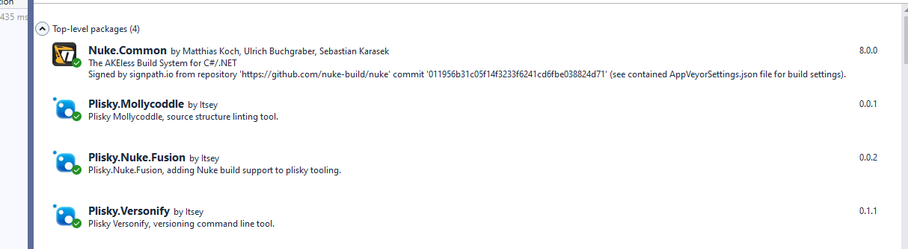

### Mollycoddle Nuke Build


### Plisky.Nuke.Fusion package

To use Mollycoddle in a nuke build include the Plisky.Nuke.Fusion package, this will provde access to the tasks below for Mollycoddle.


>You should also add a package reference to Mollycoddle itself, this will ensure that the tool is available to the build engine.  If you do not do this Nuke will throw an exception indicating that the package can not be found.





A typical molly scan task looks like this

``` csharp

    Target MollyCheck => _ => _
       .DependsOn(Initialise)
       .Before(Precheck)
       .After(Clean)
       .Executes(() => {
           MollycoddleTasks.PerformScan(s => s
               .AddRuleHelp(true)
               .SetRulesFile(@"<pathtorilesfile>\XXVERSIONNAMEXX\defaultrules.mollyset")
               .SetPrimaryRoot(@"<pathtoprimaryfiles>")
               .SetDirectory(GitRepository.LocalDirectory)
       });

```

You will usually target the GitRepository directory for the root of the scan.  The tasks include a version name of "default" by default therefore xxversionnamexx will be replaced by default.

If there are no violations the log will show in the nuke log as follows:


All of the molly command line options are supported.