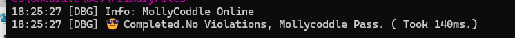

[Home](index.md) | [Mollycoddle](molly-index.md) | [Command Line](molly-commandline.md) | [QuickStart](molly-quickstart.md) | [CreateRules](molly-createRules.md) |  [Fallout](molly-nuke.md)

# Mollycoddle Fallout Build

## Plisky.Fallout.Fusion package

To use Mollycoddle in a Fallout build include the `Plisky.Fallout.Fusion` package. This is the maintained successor to the legacy `Plisky.Nuke.Fusion` package and provides access to the tasks below for Mollycoddle.
> You should also add a package reference to Mollycoddle itself, this will ensure that the tool is available to the build engine.  If you do not do this Fallout will throw an exception indicating that the package can not be found.
```xml
  <ItemGroup>
    <PackageReference Include="Fallout.Common" Version="10.4.0" />
    <PackageReference Include="Plisky.Fallout.Fusion" Version="1.0.0" />
  </ItemGroup>

  <ItemGroup>
    <PackageDownload Include="Plisky.Mollycoddle" Version="[1.0.3]" />
  </ItemGroup>
```


A typical molly scan task looks like this

```csharp
    Target MollyCheck => _ => _
       .DependsOn(Initialise)
       .Before(Precheck)
       .After(Clean)
       .Executes(() => {
           MollycoddleTasks.PerformScan(s => s
               .AddRuleHelp(true)
               .SetRulesFile(@"<pathtorulesfile>\XXVERSIONNAMEXX\defaultrules.mollyset")
               .SetPrimaryRoot(@"<pathtoprimaryfiles>")
               .SetDirectory(GitRepository.LocalDirectory)
       });
```

You will usually target the GitRepository directory for the root of the scan.  The tasks include a version name of "default" by default therefore xxversionnamexx will be replaced by default.

If there are no violations the log will show in the fallout log as follows:



All of the molly command line options are supported.